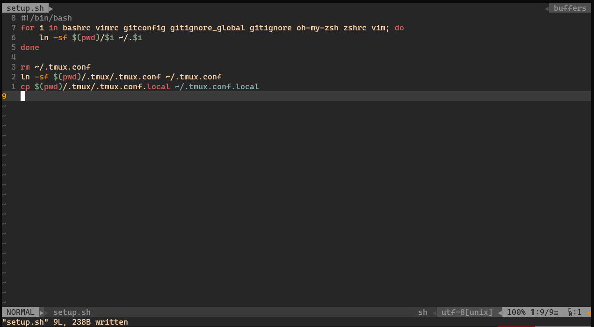
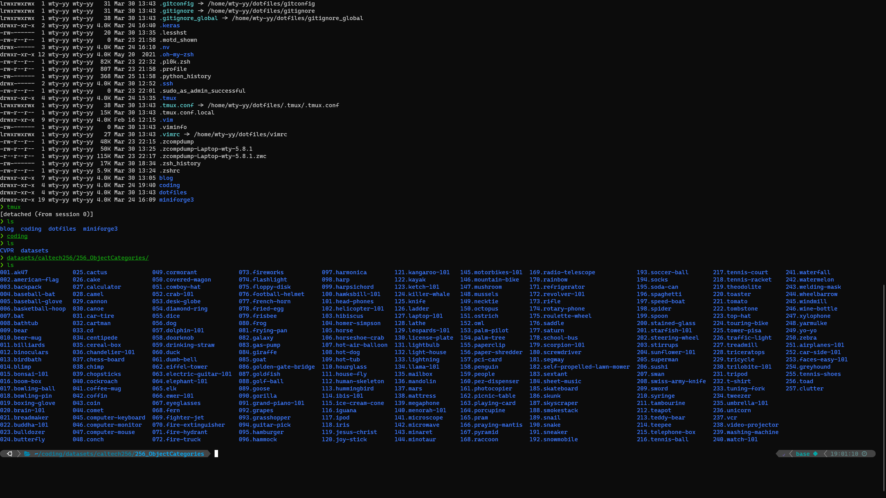

# My Dotfiles

## Content

- `.tmux` config: https://github.com/gpakosz/.tmux

  

- `.vim, .vimrc` config

  

- `.bashrc` config: add `ls` and `la` to show files, since we use zsh, so this is not significant.

- `.zshrc, .oh-my-zsh` config: use `p10k` themes (you need change an appropriate font: like [`CaskaydiaCove Nerd Font Complete`](https://github.com/wty-yy/LaTex-Projects/blob/main/Fonts/Caskaydia%20Cove%20Nerd%20Font%20Complete.ttf) or choose one from [nerd-fonts](https://github.com/ryanoasis/nerd-fonts))

  

- `gitignore_global`: set global ignore files.

## Usage

Get into the directory, use `chmod` can change the highest access permissions, make `.sh` file can be run.

```sh
cd dotfiles
chmod 777 setup.sh
./setup.sh
```

