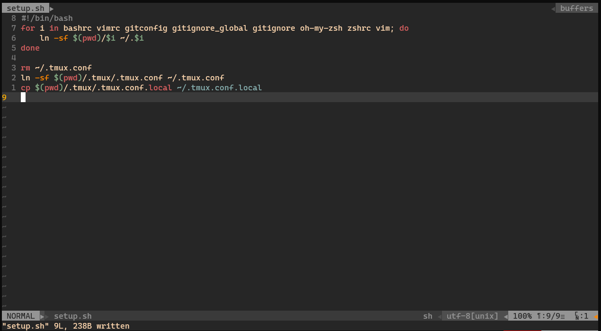
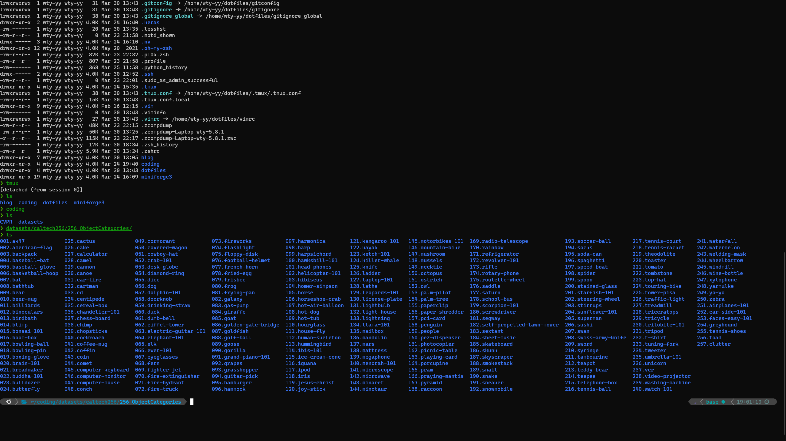

# My Dotfiles

## Update

- 2026.3.11：更新[docker/ubuntu_p10k](./docker/ubuntu_p10k/)增加了一个基于Ubuntu 24.04的Docker镜像，内置了`zsh`、`vim`，其中`zsh`包含`p10k`主题以及相关插件，`vim`使用了`gruvbox`主题。
- 2026.3.8：更新[codex_vscode_extension_add_proxy](./scripts/codex_vscode_extension_add_proxy.sh)自动修改vscode extension中的codex，为其添加指定端口的proxy端口代理，支持`~/.vscode, ~/.vscode-server, ~/.vscode-server-container`三个文件夹下的自动修改
- 2026.3.3：更新[auto_remote_config](./scripts/auto_remote_config/)能自动加入zerotier，打开sshd，安装可视化界面，从而在zerotier的局域网下可以直接通过ssh和noVNC控制本机

## Usage

Firstly, install relative packages.

```bash
sudo apt install vim git zsh tmux wget curl
```

Use proxy, if need:
```bash
export https_proxy=http://127.0.0.1:7890  # change proxy id:port
```

Install oh-my-zsh:
```bash
sudo apt install zsh
# China
sh -c "$(wget -O- https://gitee.com/mirrors/oh-my-zsh/raw/master/tools/install.sh)"
# Others
sh -c "$(wget -O- https://raw.githubusercontent.com/ohmyzsh/ohmyzsh/master/tools/install.sh)"
```

Get into the directory, use `chmod` can change the highest access permissions, make `.sh` file can be run.

```sh
cd ~
git clone --depth 1 https://github.com/wty-yy/dotfiles.git
cd dotfiles
chmod 777 setup.sh
./setup.sh  # setup for now user
sudo ./setup.sh  # setup for root user
```

Set zsh as default shell:

```sh
chsh -s $(which zsh)
```

Enjoy command: `vim`, `tmux`, `zsh`

## Content

log out computer and log back in. (https://askubuntu.com/questions/131823/how-to-make-zsh-the-default-shell)

- `.tmux` config: https://github.com/gpakosz/.tmux

  

- `.vim, .vimrc` config

  

- `.bashrc` config: add `ls` and `la` to show files, since we use zsh, so this is not significant.

- `.zshrc, .oh-my-zsh` config: use `p10k` themes (you need change an appropriate font: like [`CaskaydiaCove Nerd Font Complete`](https://github.com/wty-yy/LaTex-Projects/blob/main/Fonts/Caskaydia%20Cove%20Nerd%20Font%20Complete.ttf) or choose one from [nerd-fonts](https://github.com/ryanoasis/nerd-fonts))

  

- `gitignore_global`: set global ignore files.


